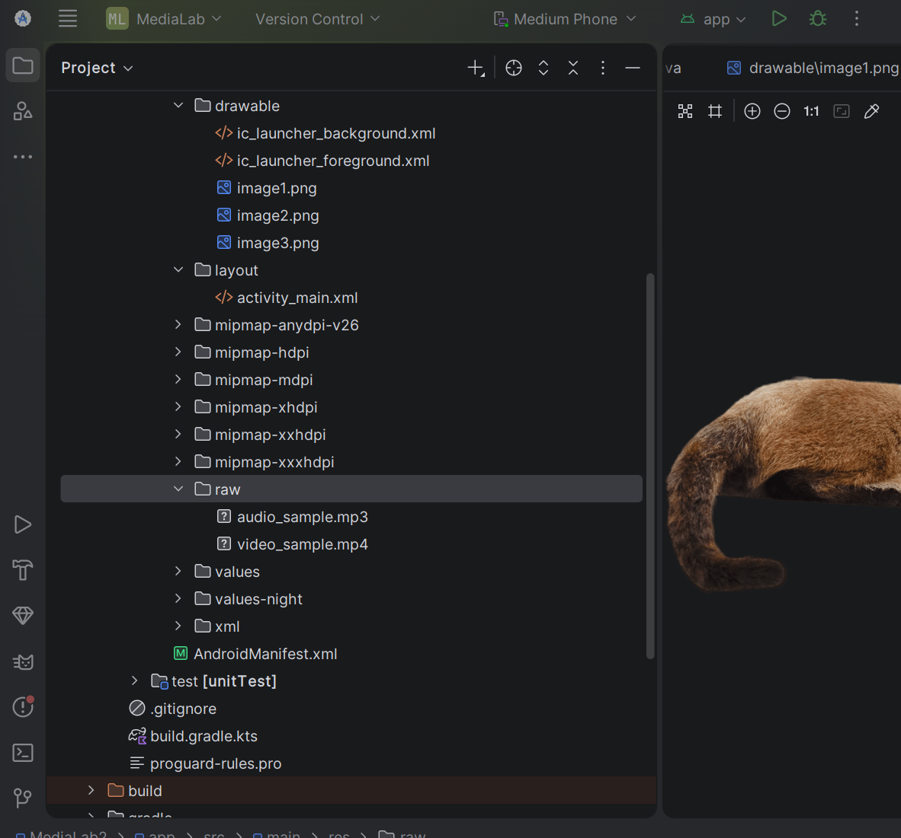
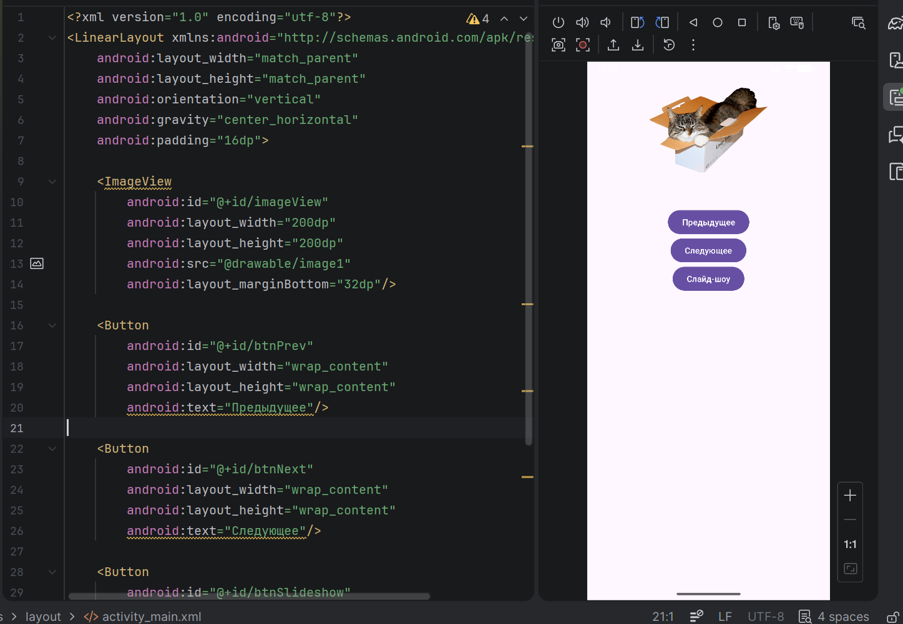
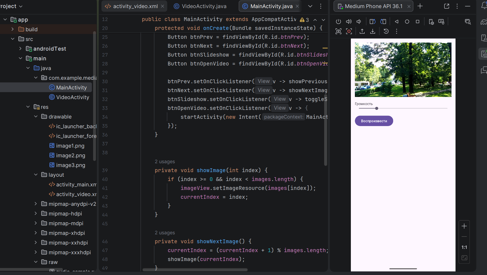
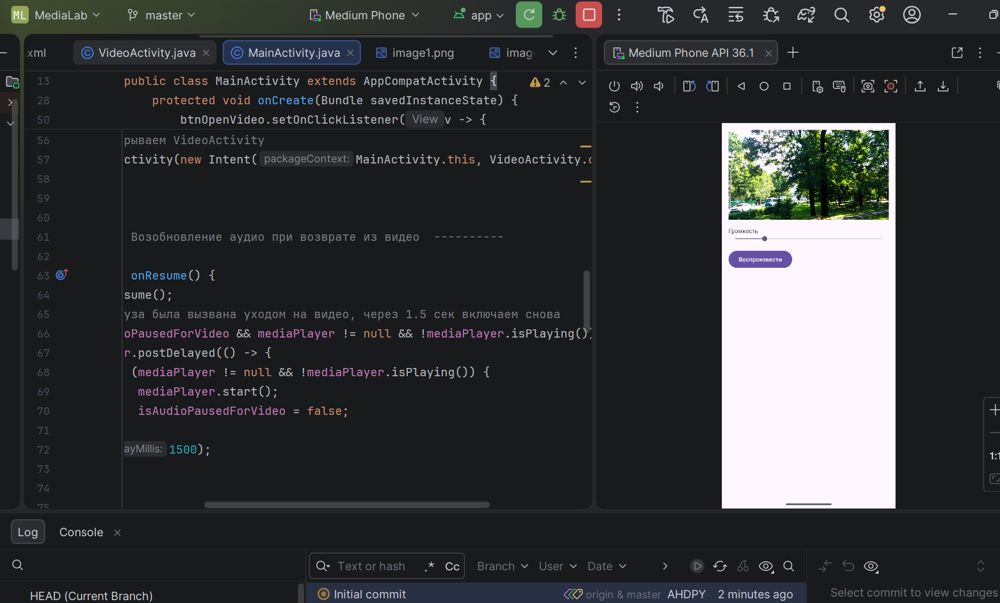

# Практическая работа №8: Ресурсы. Работа с медиа-элементами

**Выполнил:**  
Ванчин Сергей Андреевич 
Группа: ИНС-б-о-24-1  
Направление: 09.03.02 «Информационные системы и технологии»

---

## Цель работы

Изучить способы добавления и отображения графических ресурсов, научиться работать с аудио- и видеофайлами в Android-приложениях, освоить управление воспроизведением медиа-контента.

---

## Ход работы

### Задание 1. Подготовка ресурсов

Создан проект `MediaLab`. В папку res/drawable добавлены 3 изображения (image.png). В папку res/raw добавлены аудиофайл `audio_sample.mp3` и видеофайл `video_sample.mp4`.



**Рисунок 1** — Добавленные медиафайлы в `res/raw` и `res/drawable`

---

### Задание 2. Слайд-шоу из изображений

В `activity_main.xml` размещены `ImageView` и три кнопки: «Предыдущее», «Следующее», «Слайд-шоу». В `MainActivity` реализована логика переключения изображений и автоматическая смена каждые 2 секунды с помощью `Timer`.

**Код MainActivity.java (фрагмент):**

```
private int[] images = {R.drawable.image1, R.drawable.image2, R.drawable.image3, R.drawable.image4};
private int currentIndex = 0;
private Timer slideshowTimer;

private void showNextImage() {
    currentIndex = (currentIndex + 1) % images.length;
    imageView.setImageResource(images[currentIndex]);
}

private void toggleSlideshow() {
    if (slideshowTimer != null) {
        slideshowTimer.cancel();
        slideshowTimer = null;
    } else {
        slideshowTimer = new Timer();
        slideshowTimer.schedule(new TimerTask() {
            @Override
            public void run() {
                runOnUiThread(() -> showNextImage());
            }
        }, 0, 2000);

    }
}
```


**Рисунок 2** —  Главный экран с изображением и кнопками управления

### Задание 3. Воспроизведение видео
Создана `VideoActivity` с разметкой, содержащей VideoView, SeekBar для громкости и кнопку «Воспроизвести». Реализовано управление громкостью через AudioManager, добавлены стандартные элементы управления (MediaController).
Класс VideoActivity.java (ключевые части)
```
public class VideoActivity extends AppCompatActivity {
    private VideoView videoView;
    private SeekBar volumeSeekBar;
    private AudioManager audioManager;

    @Override
    protected void onCreate(Bundle savedInstanceState) {
        super.onCreate(savedInstanceState);
        setContentView(R.layout.activity_video);

        videoView = findViewById(R.id.videoView);
        volumeSeekBar = findViewById(R.id.volumeSeekBar);
        audioManager = (AudioManager) getSystemService(Context.AUDIO_SERVICE);

        // Настройка громкости через SeekBar
        int maxVolume = audioManager.getStreamMaxVolume(AudioManager.STREAM_MUSIC);
        volumeSeekBar.setMax(maxVolume);
        volumeSeekBar.setProgress(audioManager.getStreamVolume(AudioManager.STREAM_MUSIC));

        volumeSeekBar.setOnSeekBarChangeListener(new SeekBar.OnSeekBarChangeListener() {
            @Override
            public void onProgressChanged(SeekBar seekBar, int progress, boolean fromUser) {
                audioManager.setStreamVolume(AudioManager.STREAM_MUSIC, progress, 0);
            }
            // ... пустые методы onStartTrackingTouch, onStopTrackingTouch
        });

        // Медиаконтроллер для управления воспроизведением
        MediaController mediaController = new MediaController(this);
        mediaController.setAnchorView(videoView);
        videoView.setMediaController(mediaController);

        // Установка источника видео из res/raw
        String videoPath = "android.resource://" + getPackageName()
                + "/" + R.raw.video_sample;
        videoView.setVideoURI(Uri.parse(videoPath));

        // Запуск по кнопке
        findViewById(R.id.btnPlayVideo).setOnClickListener(v -> videoView.start());
    }

    @Override
    protected void onDestroy() {
        super.onDestroy();
        videoView.stopPlayback(); // освобождение ресурсов
    }
}
```



**Рисунок 3** —  Главный экран с изображением и кнопками управления

### Задание 4. Фоновое аудио с приоритетами
В MainActivity при старте приложения запускается фоновое аудио через MediaPlayer с зацикливанием. При переходе в VideoActivity аудио ставится на паузу, а после остановки видео – возобновляется с задержкой 1.5 секунды.
```
// Инициализация и запуск фонового аудио (в onCreate)
mediaPlayer = MediaPlayer.create(this, R.raw.audio_sample);
mediaPlayer.setLooping(true);   // зацикливание
mediaPlayer.start();

// Пауза при переходе к видео
btnOpenVideo.setOnClickListener(v -> {
    if (mediaPlayer != null && mediaPlayer.isPlaying()) {
        mediaPlayer.pause();
        isAudioPausedForVideo = true;   // запоминаем, что пауза — для видео
    }
    startActivity(new Intent(MainActivity.this, VideoActivity.class));
});

// Возобновление аудио при возврате из видео (onResume)
@Override
protected void onResume() {
    super.onResume();
    if (isAudioPausedForVideo && mediaPlayer != null && !mediaPlayer.isPlaying()) {
        handler.postDelayed(() -> {
            if (mediaPlayer != null && !mediaPlayer.isPlaying()) {
                mediaPlayer.start();
                isAudioPausedForVideo = false;
            }
        }, 1500);  // задержка 1.5 секунды
    }
}

// Освобождение ресурсов при уничтожении Activity
@Override
protected void onDestroy() {
    super.onDestroy();
    if (mediaPlayer != null) {
        mediaPlayer.stop();
        mediaPlayer.release();
        mediaPlayer = null;
    }
}
```


**Рисунок 4** —  Фоновое аудио с приоритетами

## Контрольные вопросы (Практическая работа №8)

### 1. Какие типы ресурсов существуют в Android? Для чего предназначены папки drawable, raw, values?

- drawable – графические ресурсы (PNG, JPG, XML-фигуры, селекторы, анимации).  
- raw – произвольные файлы в исходном виде (аудио, видео, текстовые файлы). Доступ через `R.raw.имя`.  
- values – ресурсы, определённые в XML (строки `strings.xml`, цвета `colors.xml`, размеры `dimens.xml`, стили, массивы).  


### 2. Как добавить изображение в приложение и отобразить его в ImageView двумя способами (из ресурсов и из файловой системы)?

**Из ресурсов drawable:**  
```
ImageView imageView = findViewById(R.id.imageView);
imageView.setImageResource(R.drawable.my_image);
```
Из файловой системы (внешнее хранилище):

```
File imgFile = new File(Environment.getExternalStorageDirectory(), "image.png");
Bitmap bitmap = BitmapFactory.decodeFile(imgFile.getAbsolutePath());
imageView.setImageBitmap(bitmap);
```
### 3. Опишите жизненный цикл MediaPlayer. Какие методы необходимо вызвать для воспроизведения аудиофайла из ресурсов?
Жизненный цикл:
Idle → Initialized → Preparing → Prepared → Started → Paused / Stopped → Released.

Для воспроизведения из ресурсов:
```
MediaPlayer mp = MediaPlayer.create(context, R.raw.audio_sample); // сам вызывает prepare()
mp.start(); // переход в Started
// mp.pause(), mp.stop(), mp.release() при завершении
```
### 4. Для чего используется класс AudioManager? Как получить его экземпляр и изменить громкость?
AudioManager управляет громкостью, режимами звука, переключением аудиоустройств.
Получение экземпляра: `AudioManager am = (AudioManager) getSystemService(Context.AUDIO_SERVICE);`
Изменение громкости аудиопотока (например, музыки):
```
int max = am.getStreamMaxVolume(AudioManager.STREAM_MUSIC);
am.setStreamVolume(AudioManager.STREAM_MUSIC, желаемое_значение, 0);
```
### 5. Что такое VideoView и MediaController? Как их использовать для создания простого видеоплеера?
VideoView – виджет для отображения видео, содержит встроенный MediaPlayer и управляет поверхностью.

MediaController – стандартные элементы управления (play/pause, перемотка, прогресс-бар).
Пример:
```
VideoView videoView = findViewById(R.id.videoView);
videoView.setVideoURI(Uri.parse("android.resource://" + getPackageName() + "/" + R.raw.video_sample));
MediaController mc = new MediaController(this);
mc.setAnchorView(videoView);
videoView.setMediaController(mc);
videoView.start();
```

### 6. Почему при обновлении UI (например, SeekBar) из TimerTask нужно использовать runOnUiThread()?
TimerTask выполняется в фоновом потоке. Обновлять UI можно только из главного (UI) потока, иначе возникнет исключение CalledFromWrongThreadException.
runOnUiThread() переключает код в UI-поток.

### 7. Как сделать, чтобы аудиофайл воспроизводился бесконечно (зацикливался)?
`mediaPlayer.setLooping(true);`
После окончания воспроизведения звук автоматически начнётся заново.
### 8. Какие разрешения необходимы для доступа к медиафайлам на внешнем хранилище в разных версиях Android?
Android 5–12:	READ_EXTERNAL_STORAGE, WRITE_EXTERNAL_STORAGE (для записи)
Android 13+: READ_MEDIA_IMAGES, READ_MEDIA_AUDIO, READ_MEDIA_VIDEO (раздельно для каждого типа)


